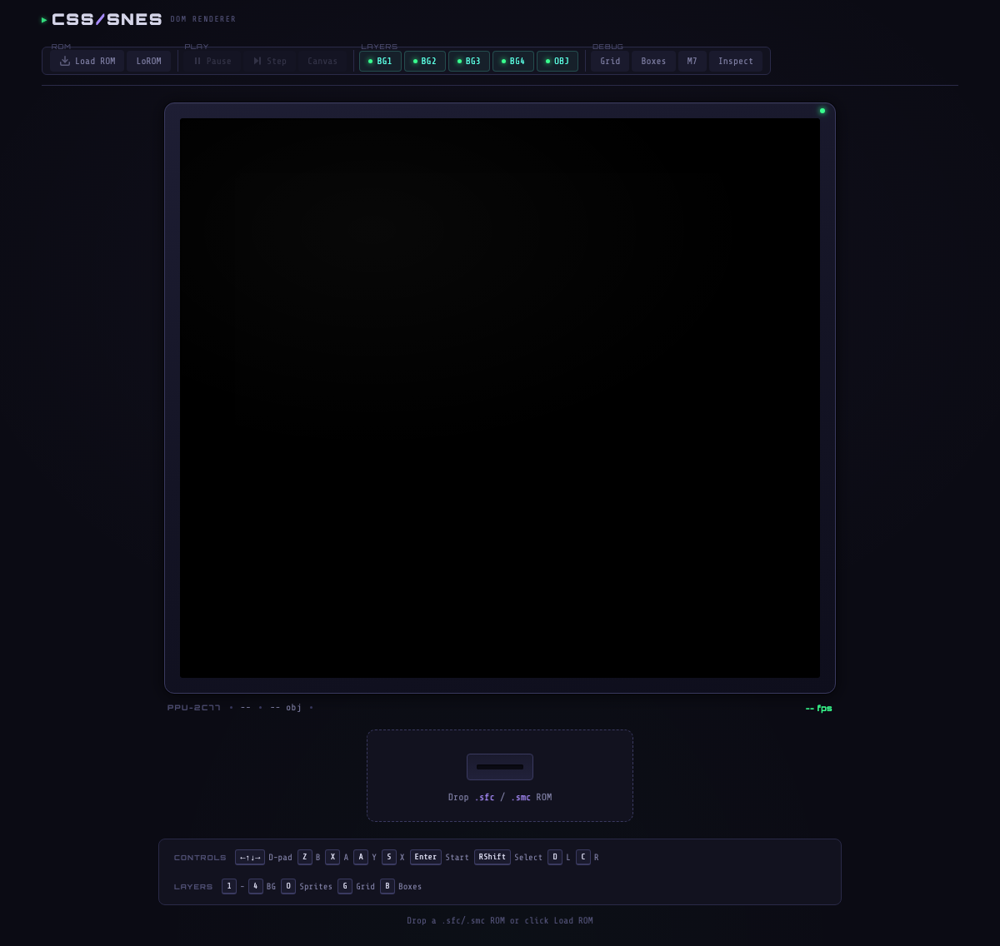
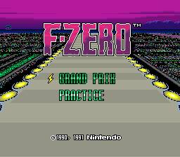
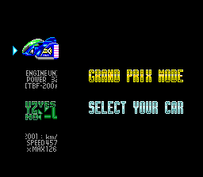
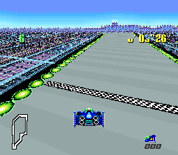

# CSS/SNES

**A Super Nintendo rendered entirely with CSS DOM elements.** No `<canvas>`. No WebGL. Just `<div>`s with `background-image`, `z-index`, and a mass of questionable life decisions.

Every frame, the emulated SNES PPU state is read and translated into positioned HTML elements — tiles become CSS grid cells with spritesheet backgrounds, scroll registers become `left`/`top` offsets, palette lookups become class selectors, and the SNES priority system becomes a z-index table that would make any sane frontend developer weep.

Developed against **F-Zero** because if you're going to render a 16-bit console with stylesheets, you might as well pick the game with a hardware-warping pseudo-3D racetrack.

<p align="center">
  
</p>

## Screenshots

All rendered with CSS DOM elements. The only canvas in the building is the Mode 7 floor (we're insane, not suicidal).

<p align="center">
  &nbsp;&nbsp;
  
</p>
<p align="center">
  <em>Title screen (Mode 7 perspective road + CSS BG layers) · Car selection (pure CSS tile rendering, ~4% pixel diff)</em>
</p>

<p align="center">
  
</p>
<p align="center">
  <em>Mode 7 race track — the road is a software-rasterized canvas composited with CSS sprite and BG layers</em>
</p>

## How it works

Every frame, in roughly 16ms of pure hubris:

1. **SnesJs** (vendored, ES-module-wrapped) runs the emulated CPU + PPU and updates internal state.
2. **PPUStateExtractor** reads `snes.ppu.*` and produces a clean snapshot: BG layer configs, 128 sprites, color math, window registers, Mode 7 matrix, and per-scanline data.
3. **TileCache** decodes VRAM tiles into PNG spritesheets (128×128 grids of 8×8 tiles), injected as data-URL `background-image` rules. Sheets are only regenerated when VRAM or palette data actually changes, because we may be unhinged but we're not wasteful.
4. **BGLayer** (×4) maintains a CSS grid of `<div>` tiles per BG channel. Each channel has *two* sub-layer roots — one for low-priority tiles (tilemap bit 13 = 0) and one for high-priority (bit 13 = 1). Their z-indices interleave with sprites according to per-mode priority tables. Scroll is applied as `left`/`top` on quadrant divs.
5. **SpriteLayer** positions 128 pre-created `<div>` sprite elements. Multi-tile sprites (16×16, 32×32, 64×64) are composited from 8×8 sub-divs. Each sprite gets a z-index based on its OAM priority bits.
6. **Mode7Layer** handles the SNES's signature pseudo-3D effect. When per-scanline Mode 7 data is detected (via HDMA instrumentation), a software rasterizer draws the affine-transformed BG onto a canvas. Otherwise, a CSS 3D perspective fallback is used.
7. **ScanlineCompositor** handles F-Zero's mid-frame mode switching — the top half of the screen is Mode 1 (sky/city) while the bottom half is Mode 7 (road). It routes each scanline to the correct renderer.

### Priority (a.k.a. "the z-index table from hell")

The SNES doesn't do simple "layers on top of layers" — priority is per-tile *and* per-sprite, interleaved differently in each BG mode. Here's Mode 1 (F-Zero's primary mode):

| Layer | z-index |
|-------|---------|
| Sprite priority 3 | 10 |
| BG1 high-priority tiles | 9 |
| BG2 high-priority tiles | 8 |
| Sprite priority 2 | 7 |
| BG1 low-priority tiles | 6 |
| BG2 low-priority tiles | 5 |
| Sprite priority 1 | 4 |
| BG3 high-priority tiles | 3 |
| Sprite priority 0 | 2 |
| BG3 low-priority tiles | 1 |

Mode 0 uses a 12-level table. Mode 1 with `layer3Priority` promotes BG3-high to the very top (z-index 11), which F-Zero uses for the HUD.

## Project structure

```
src/
  app.js                 Game loop, ROM loading, input, toolbar wiring
  ppu-state-extractor.js Reads snes.ppu.*, produces PPU state snapshot
  css-renderer.js        Orchestrates all layers; z-index priority tables
  bg-layer.js            Dual-root BG layer (lo/hi priority sub-layers)
  bg-canvas-renderer.js  Software BG renderer for HDMA per-scanline scroll
  sprite-layer.js        128 sprite <div>s with OAM priority z-index
  mode7-layer.js         Mode 7 software rasterizer + CSS 3D fallback
  scanline-compositor.js Per-scanline compositor for mid-frame mode switches
  tile-cache.js          VRAM → PNG spritesheets (128×128 / 256×256)
  debug-panels.js        Scanline inspector ruler + graph
styles/
  snes-layers.css        Viewport, tile, sprite, Mode 7, CRT frame, UI
packages/
  snesjs/                Vendored SnesJs (angelo-wf/SnesJs), ES module wrapper
tests/
  e2e/fzero.spec.js      Playwright pixel-diff test against F-Zero
```

## Getting started

```sh
npm install
npm run dev          # Vite dev server
```

Open the page, drop a `.sfc` / `.smc` ROM onto the cartridge slot (or click **Load ROM**). The LoROM/HiROM button toggles addressing mode — most games are LoROM.

### Keyboard controls

| Key | SNES | | Key | SNES |
|-----|------|-|-----|------|
| Arrow keys | D-pad | | `Enter` | Start |
| `Z` | B | | `Right Shift` | Select |
| `X` | A | | `D` | L shoulder |
| `A` | Y | | `C` | R shoulder |
| `S` | X | | | |

**Layer toggles:** `1`–`4` for BG1–BG4, `O` for sprites.
**Debug overlays:** `G` tile grid, `B` sprite bounding boxes, `7` Mode 7 wireframe.
**Mode 7 CSS approximation:** `M` toggles the `M7 CSS` button (forces the CSS approximation path for Mode 7 instead of the scanline compositor).

### Canvas comparison mode

Click **Canvas** to swap to the SnesJs pixel-perfect canvas output. Useful for comparing CSS fidelity against the reference renderer and questioning your priorities in life.

## Building

```sh
npm run build        # Vite production build → dist/
```

## Tests

```sh
npm run test:e2e     # Playwright E2E (boots F-Zero, pixel-diffs key frames)
```

The test boots F-Zero for 1000+ frames, navigates through menus to the race track, and pixel-diffs the CSS output against the reference canvas at each checkpoint. Current results:

| Checkpoint | Pixel diff | Notes |
|------------|-----------|-------|
| Title screen | ~13% | Mode 7 perspective road + scanline compositor active |
| Car selection | ~4% | Pure CSS tile rendering — the good stuff |
| Race track | ~22% | Mode 7 software rasterizer + mixed-mode compositing |

Requires the ROM at `roms/F-ZERO (E).smc` (not included — bring your own legally obtained ROM).

## Known limitations

This is a CSS renderer for a 1990 game console. Expectations should be calibrated accordingly.

- **Mode 7 accuracy vs. CSS tradeoff.** Default Mode 7 rendering is software-rasterized (scanline-accurate). The `M7 CSS` toggle forces a CSS approximation path (affine transform + scanline clip), which is less accurate but useful for experimenting with CSS-only composition.

- **No sub-screen color math.** The SNES has a main screen and a sub-screen that can be blended together for transparency, color addition/subtraction, and other effects. We only do main-screen window clipping. Color math is approximated with CSS `brightness()` and `opacity`, which is like approximating a symphony with a kazoo.

- **Window clipping is per-frame, not per-scanline.** SNES windows can change mid-frame via HDMA. We compute `clip-path` once per frame from the register state. Complex multi-window interactions (overlapping windows with different logic ops) may not be pixel-perfect.

- **Priority is per-tile, not per-pixel.** The SNES resolves priority at the pixel level — a transparent pixel in a high-priority tile should show through to lower layers. CSS z-index operates on entire elements. We get the tile/sprite interleaving order correct per the mode tables, but individual transparent pixels within a tile won't properly reveal layers behind them. This is the fundamental CSS limitation and there's no real fix short of... using a canvas. Which would defeat the point.

- **HDMA BG scroll falls back to canvas.** When per-scanline background scroll is detected (common in F-Zero's sky), the affected BG channel switches from CSS tile divs to a software-rendered canvas. CSS can't do "different scroll offset per pixel row."

- **Only tested with F-Zero.** Other games may have PPU features or timing quirks we haven't encountered. Mode 0, Mode 2–6, and HiRes modes are structurally supported but not battle-tested. If your favorite game looks wrong, that's a feature request, not a bug. (It's definitely a bug.)

- **Performance varies.** Maintaining hundreds of DOM elements per frame is not what browsers were optimized for. Modern Chrome/Safari handle it well at 60fps. Older hardware or Firefox may struggle. The emulator CPU is the actual bottleneck — the CSS rendering itself is surprisingly fast, because browsers are *very* good at what we're abusing them for.

## Why?

Because someone had to find out if it was possible, and none of us were brave enough to say no.

Also: it's a genuinely interesting way to understand the SNES PPU. When every tile is a visible DOM element you can inspect, every priority band is a z-index you can read, and every scroll register maps to a CSS property — the hardware architecture becomes tangible in a way that a canvas blob never achieves.

## Credits

- **SnesJs** by [angelo-wf](https://github.com/angelo-wf/SnesJs) — the JavaScript SNES emulator that makes this possible
- **F-Zero** by Nintendo (1990) — still the best Mode 7 showcase three decades later
